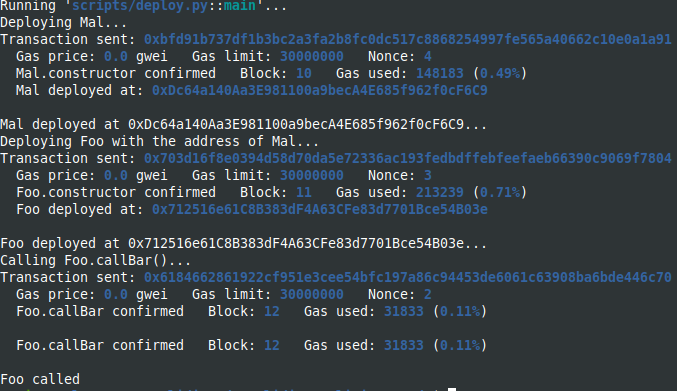
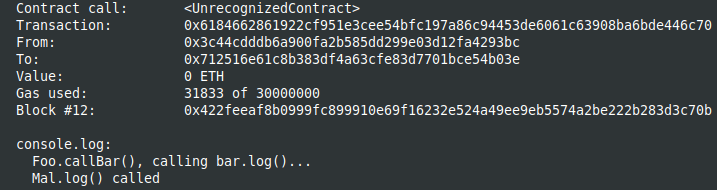

Study case of Bypass Contract Size Check hack, from Solidity by example site [Solidity by Example](https://solidity-by-example.org/hacks/hiding-malicious-code-with-external-contract/)

I use brownie to compile and deploy into hardhat in order to have the console.log feature.
You should start the hardhat node in another terminal and folder (`hh node`), then, in a terminal :

```
brownie compile
brownie run scripts/deploy.py
```

After deploying from brownie :


The result in the hardhat console :



The contract should be initialized properly in constructor, as bellow:

```
Bar public bar;
constructor() public {
    bar = new Bar();
    console.log("Foo.constructor(), _bar is %s", address(bar));
}
```
